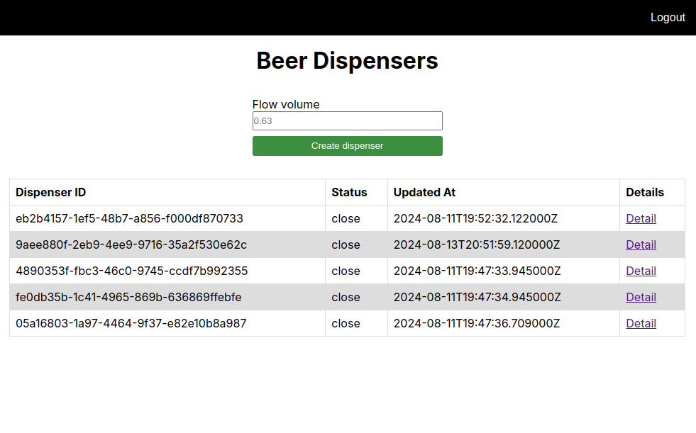

# Beer Tap Dispenser

This is a [Next.js](https://nextjs.org/) project bootstrapped with [`create-next-app`](https://github.com/vercel/next.js/tree/canary/packages/create-next-app). It contains an application for updating and managing virtual beer tap dispensers.

## Getting Started

Before running the frontend application, make sure you launched the backend side, because there is no mocks or endpoint interceptions implemented.

Once the backend is up and running, run the script to build the docker image:

```bash
docker build -t beer-tap-dispenser-fe .
```
then, when the image is created, run it launching the following:

```bash
docker run -p 3000:3000 beer-tap-dispenser-fe
```

Finally, open [http://localhost:3000](http://localhost:3000) with your browser to access the application.

## Available routes

### / (root)


### /login


### /Dispensers page



### /Dispenser detail page


## Sources

- [Next.js Docs](https://nextjs.org/)
- [Tutorial Next.js 14](https://www.youtube.com/watch?v=jMy4pVZMyLM&t=777s)
- [Dockerize a Next.js App](https://medium.com/@itsuki.enjoy/dockerize-a-next-js-app-4b03021e084d)
